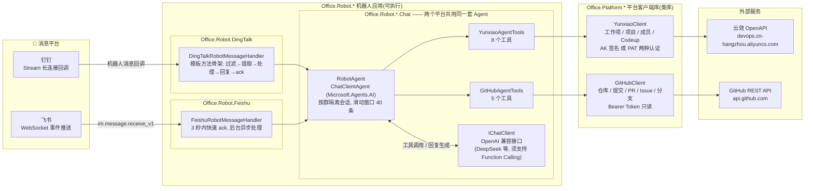
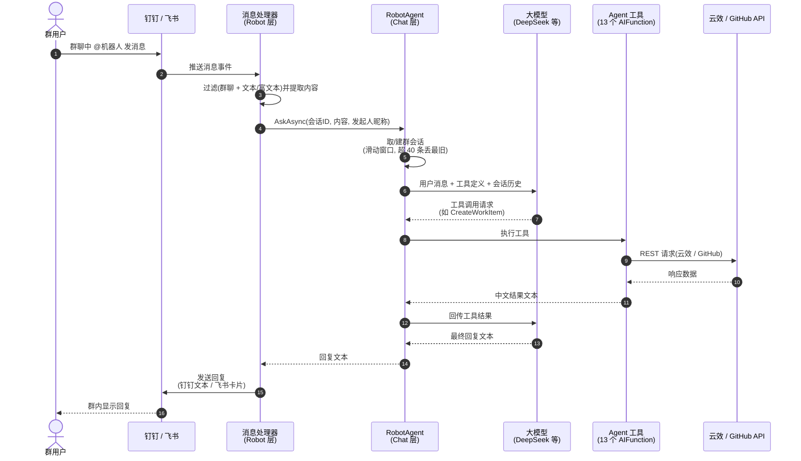
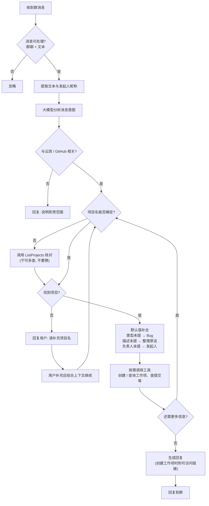

# 办公机器人

> 项目代号 `Office.Robot`(原仓库名 Sky.DingTalk.AI):已重构为 `Office.Platform.*`(平台客户端库)+ `Office.Robot.*`(机器人应用)的命名结构。

把口语化的群聊消息变成云效工作项、查代码仓库和 GitHub 动态的 AI 机器人。支持**钉钉**与**飞书**两个消息平台,共享同一套 AI Agent 与平台客户端。

用户 @机器人 说一句"xx 项目有个 bug,登录时报错",机器人自动补全信息(类型默认 Bug、负责人默认发起人)、调用云效 API 创建工作项,并把工作项链接回复到群里。也可以直接问"最近有哪些提交"、"帮我看看那个 PR"——机器人会自己决定调用哪个工具。

## 架构



## 项目结构

| 项目 | 类型 | 职责 |
| --- | --- | --- |
| `Office.Robot.DingTalk` | 可执行 | 钉钉机器人:Stream 长连接接入 + AI Agent |
| `Office.Robot.Feishu` | 可执行 | 飞书机器人:WebSocket 长连接接入 + AI Agent |
| `Office.Platform.YunXiao` | 类库 | 云效客户端:工作项(Bug/Req/Task)、项目、成员、Codeup 代码仓库 |
| `Office.Platform.GitHub` | 类库 | GitHub 只读客户端:仓库、提交、PR、Issue、分支 |

两个机器人应用中的 `Chat/` 目录(AI Agent、工具集、服务注册)逻辑完全一致,差异只在 `Robot/` 目录的消息接入层:

| | 钉钉 | 飞书 |
| --- | --- | --- |
| 接入方式 | Stream 长连接(官方 Stream 模式) | WebSocket 长连接(FeishuNetSdk) |
| 消息事件 | 机器人消息回调(CALLBACK) | `im.message.receive_v1` 事件 |
| 处理超时 | 无特殊限制,同步处理 | 事件回调须 3 秒内 ack,AI 处理在后台异步执行 |
| 回复格式 | 文本消息 | interactive 卡片(lark_md 渲染 Markdown) |
| 支持的消息 | text / richtext | 仅 text,仅群聊(单聊忽略) |

## 工作流程

### 消息处理时序



### Agent 决策流程



## 内置工具

Agent 通过 Function Calling 自动调用以下 13 个工具,所有工具返回中文文本(含失败原因),便于模型直接组织回复:

### 云效工具集(`YunxiaoAgentTools`)

| 工具 | 用途 |
| --- | --- |
| `ListProjects` | 列出组织下全部项目,核对项目名 |
| `ListProjectMembers` | 列出项目成员,用于指定负责人 |
| `CreateWorkItem` | 创建工作项(Bug 缺陷 / Req 需求 / Task 任务),返回工作项地址 |
| `ListWorkItems` | 查询项目某类工作项列表(编号、标题、状态、负责人) |
| `ListCodeupRepositories` | 列出代码仓库(支持按名搜索) |
| `ListCodeupCommits` | 查询仓库最近提交(短 SHA、标题、作者、时间) |
| `GetCodeupCommitDetail` | 查询单个提交详情(完整 SHA、变更统计) |
| `ListCodeupBranches` | 查询仓库分支列表(含默认分支标记) |

### GitHub 工具集(`GitHubAgentTools`)

| 工具 | 用途 |
| --- | --- |
| `ListRepositories` | 列出账号可访问的仓库(owner/repo) |
| `ListCommits` | 查询仓库最近提交 |
| `ListPullRequests` | 查询 Pull Request 列表(open / closed / all) |
| `ListIssues` | 查询 Issue 列表(含标签) |
| `ListBranches` | 查询仓库分支列表 |

## 配置

所有配置在 `appsettings.json`(已加入 `.gitignore`,**禁止提交**)。首次使用复制模板:

```bash
cp Office.Robot.DingTalk/appsettings.Example.json Office.Robot.DingTalk/appsettings.json
# 或
cp Office.Robot.Feishu/appsettings.Example.json Office.Robot.Feishu/appsettings.json
```

| 配置段 | 字段 | 说明 |
| --- | --- | --- |
| `DingTalk` / `Feishu` | AppId / AppSecret 等 | 机器人应用凭证,在各开放平台「应用开发 → 凭证与基础信息」获取 |
| `Ai` | ApiKey / Endpoint / Model | OpenAI 兼容接口(默认 DeepSeek),模型须支持工具调用 |
| `Yunxiao` | OrganizationId / PersonalAccessToken | 云效组织 ID + 个人访问令牌(`pt-` 开头,「个人设置 → 个人访问令牌」创建) |
| `GitHub` | Token | GitHub Personal Access Token(`ghp_` 开头,需要 repo 读取权限) |

> 云效客户端也支持阿里云 AccessKey 认证方案(方案一:AK 签名),在 `YunxiaoOptions` 中填入 `AccessKeyId` / `AccessKeySecret` 即可,两种方案二选一。

## 快速开始

环境要求:.NET 10 SDK。

```bash
# 钉钉机器人
dotnet run --project Office.Robot.DingTalk

# 飞书机器人
dotnet run --project Office.Robot.Feishu
```

启动后机器人通过长连接接入对应平台,无需公网地址。在群里 @机器人 即可对话,例如:

- "项目 x 有个 bug:登录页面报 500"
- "帮我看看 xx 项目最近的提交"
- "查一下 xx 项目有哪些需求"

## 扩展指南

- **新增工具**:在 `Chat/YunxiaoAgentTools.cs` 或 `Chat/GitHubAgentTools.cs` 中给 `YunxiaoToolFunctions` / `GitHubToolFunctions` 加一个带 `[Description]` 的方法并注册到 `Create()` 列表,Agent 会自动发现;两个机器人项目需要同步修改。
- **新增消息平台**:参照 `Office.Robot.Feishu` 结构新建 `Office.Robot.Xxx`,`Chat/` 目录可直接复用,只需实现 `Robot/` 层的事件接收与回复。

## 已知局限

- 会话上下文按群保存在进程内存(每个群最近 40 条消息),进程重启后清空。
- 工作项创建依赖项目成员姓名与云效内用户匹配;负责人默认取发起人(@机器人的用户)。
- 飞书机器人仅处理群聊文本消息;钉钉支持文本与富文本。
